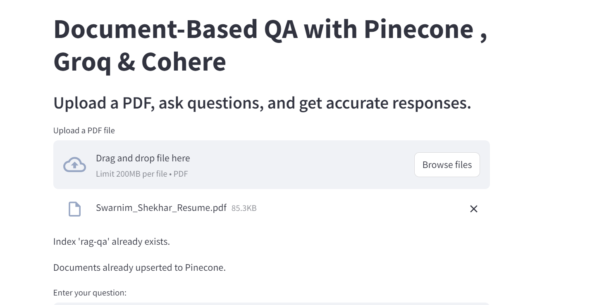
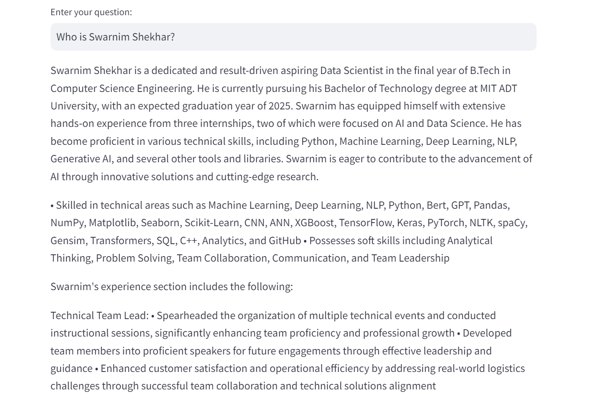
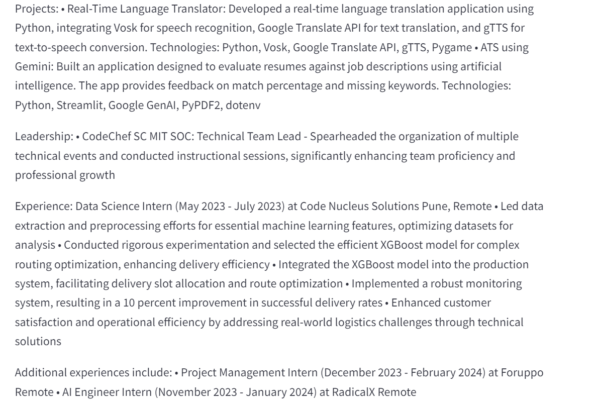
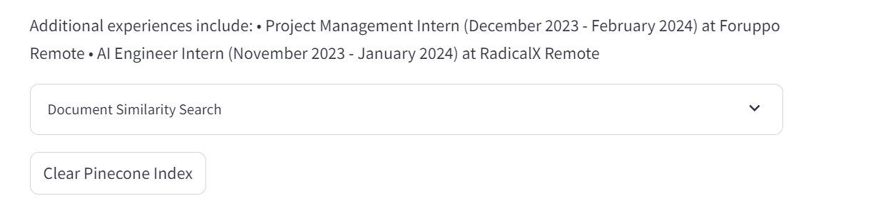
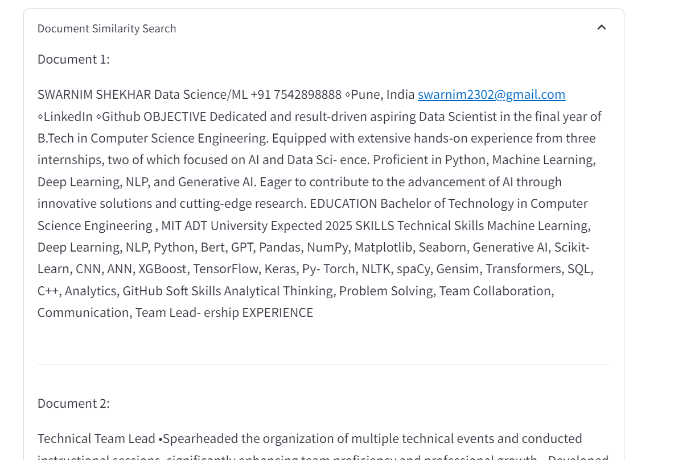
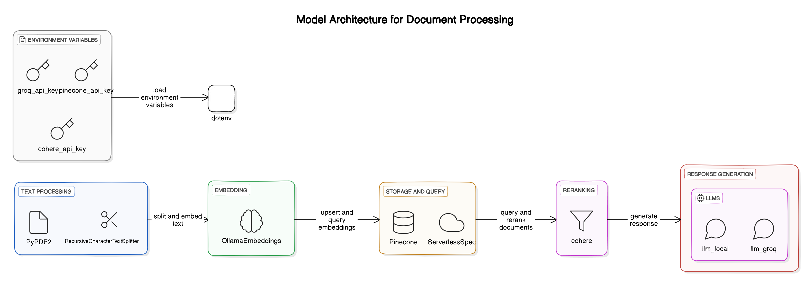
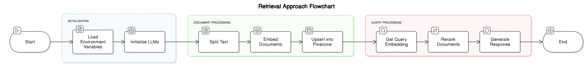
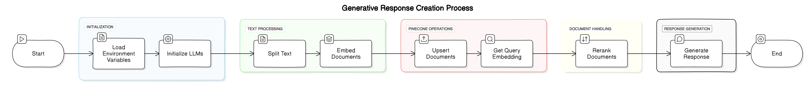
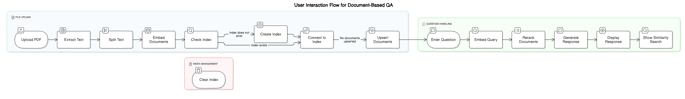

# Retrieval-Augmented Generation (RAG) Model for QA Bot

## Project Overview
This project implements a Retrieval-Augmented Generation (RAG) model for a Question Answering (QA) bot using a vector database (Pinecone) and a generative model (Cohere). The QA bot retrieves relevant information from a dataset and generates coherent answers based on user queries.

Docker Hub Link - https://hub.docker.com/r/swarnimshekhar/rag_qa/tags

**Implementation Screenshots**












## Part 1: RAG Model Implementation

### Requirements
- Python 3.10
- Libraries: 
  - `PyPDF2`
  - `langchain`
  - `langchain_groq`
  - `langchain_ollama`
  - `dotenv`
  - `pinecone-client`
  - `cohere`
  
### Pipeline Overview
1. **PDF Document Upload**: The user uploads a PDF document.
2. **Text Extraction**: Text is extracted from the PDF using `PyPDF2`.
3. **Text Chunking**: The extracted text is split into chunks using `RecursiveCharacterTextSplitter`.
4. **Document Embedding**: Each text chunk is embedded using `OllamaEmbeddings`.
5. **Storage**: The embedded documents are stored in Pinecone.
6. **User Query Input**: The user inputs a query.
7. **Query Embedding**: The query is embedded using `OllamaEmbeddings`.
8. **Document Retrieval**: Relevant documents are retrieved from Pinecone.
9. **Reranking**: Retrieved documents are reranked using Cohere.
10. **Response Generation**: A final response is generated based on the context and user query using Groq.

### Colab Notebook
A Colab notebook demonstrating the entire pipeline from data loading to question answering is included in this project.

## Part 2: Interactive QA Bot Interface

### Requirements
- Streamlit
- Docker

### Interface Overview
1. **Frontend Setup**: Built using Streamlit, allowing users to upload PDF documents and ask questions.
2. **Real-Time Processing**: The backend processes the uploaded documents, stores embeddings, and provides real-time answers.
3. **Display Results**: The interface shows the retrieved document segments alongside the generated answers.

### Running the Application
1. Clone this repository.
2. Install the required dependencies.
   ```bash
   pip install -r requirements.txt
   
### Run the Streamlit app
```bash
streamlit run app.py
```
### Docker Deployment
 To deploy the application using Docker, ensure you have Docker installed and follow these steps:

### Build the Docker image:
```bash
docker build -t rag-qa-bot .
```
### Run the Docker container:
```bash
docker run -p 8501:8501 rag-qa-bot
```
## Part 3: Documentation

1. **Model Architecture**: The architecture of the Retrieval-Augmented Generation (RAG) model is designed to integrate the retrieval of relevant documents with the generation of responses. The key components of the architecture are:

2. **Document Upload**: Users upload PDF documents containing the information required for answering queries.

3. **Text Extraction**: The text is extracted from the uploaded PDF documents using the PyPDF2 library, ensuring that the content is available for processing.

4. **Text Chunking**: The extracted text is divided into manageable chunks using the RecursiveCharacterTextSplitter, which helps in effectively embedding and retrieving information.

5. **Document Embedding**: Each chunk of text is converted into a vector representation using OllamaEmbeddings, which allows the model to understand the semantic meaning of the text.

6. **Vector Database**: The embeddings are stored in a vector database (Pinecone) for efficient retrieval based on similarity.

7. **Query Processing**: User queries are embedded in the same way as the document chunks to allow for a direct comparison and retrieval of relevant information.

8. **Retrieval**: The system retrieves the top-k relevant document chunks based on their similarity to the query embedding using the Pinecone database.

9. **Reranking**: The retrieved documents are reranked to improve the relevance of the information using Cohere's reranking model, ensuring that the most contextually appropriate documents are prioritized.

10. **Response Generation**: The final response is generated using the Groq model, which takes into account the context provided by the retrieved documents and the original user query.

### Approach to Retrieval
**The retrieval process involves the following steps**:

1. After a user uploads a PDF document, the text is extracted and chunked.
2. Each chunk is embedded and stored in Pinecone.
3. When a user submits a query, the query is also embedded, and the system retrieves the top k relevant document embeddings.
4. The retrieved documents are then reranked to ensure that the most relevant information is provided.

### Generative Responses
The generative aspect of the model leverages the Groq API, which formulates responses based on the context retrieved. The context from the top-ranked document chunks is used to generate comprehensive and coherent answers to the user’s questions.

### Example Queries
**Provided document was my resume.**

1. **What is this document?** 
```bash
This document appears to be a combination of a professional profile and a summary of various projects, experiences, and skills. Here's a breakdown of the document:

Professional Profile

A brief introduction mentioning the individual's name, contact details, and objective. The objective states that the individual is a dedicated and result-driven aspiring Data Scientist in the final year of B.Tech in Computer Science Engineering. They have extensive hands-on experience from three internships, two of which focused on AI and Data Science.
Education

Details about the individual's educational background, specifically their Bachelor of Technology in Computer Science Engineering at MIT ADT University, expected to be completed in 2025.
Skills

A list of both technical and soft skills. The technical skills include Machine Learning, Deep Learning, NLP, Python, Bert, GPT, Pandas, NumPy, Matplotlib, Seaborn, Generative AI, Scikit-Learn, CNN, ANN, XGBoost, TensorFlow, Keras, PyTorch, NLTK, spaCy, Gensim, Transformers, SQL, C++, Analytics, and GitHub. The soft skills include Analytical Thinking, Problem Solving, Team Collaboration, Communication, and Team Leadership.
Experience

Details about the individual's experiences, which include:
A Project Management Internship at Foruppo Remote from December 2023 to February 2024. The intern was responsible for spearheading the development of a Minimalistic Product Development (MPD) framework, implementing the Minimum Viable Product (MVP) concept, and utilizing agile methodologies.
An AI Engineer Internship at RadicalX Remote from November 2023 to January 2024. The intern led data preprocessing efforts and collaborated closely with data scientists and machine learning engineers.
A Data Science Internship at Code Nucleus Solutions Pune, Remote from May 2023 to July 2023. The intern led data extraction and preprocessing efforts, conducted experimentation, integrated the XGBoost model into the production system, and implemented a robust monitoring system.
Projects

Descriptions of two projects:
'Real-Time Language Translator': A project that developed a real-time language translation application using Python, Vosk for speech recognition, Google Translate API for text translation, and gTTS for text-to-speech conversion.
'ATS using Gemini': A project that built an application designed to evaluate resumes against job descriptions using artificial intelligence, providing feedback on match percentage and missing keywords.
Leadership

Details about the individual's leadership roles, specifically their role as a Technical Team Lead for CodeChef SC MIT SOC. They spearheaded the organization of multiple technical events and conducted instructional sessions, significantly enhancing team proficiency and professional growth. They also developed team members into proficient speakers for future engagements through effective leadership and guidance.
Technologies and Tools

A list of various technologies and tools mentioned throughout the document, including Python, Vosk, Google Translate API, gTTS, Pygame, Streamlit, Google GenAI, PyPDF2, dotenv, Torch, NLTK, spaCy, Gensim, Transformers, SQL, C++, Analytics, and GitHub.
```
2. **Who is Swarnim?**
```bash
Swarnim is a dedicated and result-driven aspiring Data Scientist who is currently in the final year of their B.Tech in Computer Science Engineering. They have gained extensive hands-on experience through three internships, two of which were focused on AI and Data Science. Swarnim is proficient in various technical skills such as Python, Machine Learning, Deep Learning, NLP, Generative AI, Scikit-Learn, CNN, ANN, XGBoost, TensorFlow, Keras, PyTorch, NLTK, spaCy, Gensim, Transformers, SQL, C++, Analytics, and GitHub.

In terms of soft skills, Swarnim possesses analytical thinking, problem-solving, team collaboration, communication, and team leadership abilities. They have served as a Technical Team Lead, where they spearheaded the organization of multiple technical events and conducted instructional sessions, significantly enhancing team proficiency and professional growth. Swarnim has also demonstrated effective leadership and guidance in developing team members into proficient speakers for future engagements.

Swarnim has worked on several projects, including:

Real-Time Language Translator: A real-time language translation application developed using Python, Vosk for speech recognition, Google Translate API for text translation, and gTTS for text-to-speech conversion.
ATS using Gemini: An application designed to evaluate resumes against job descriptions using artificial intelligence. The app provides feedback on match percentage and missing keywords.
Swarnim's leadership experience includes serving as the Technical Team Lead for CodeChef SC MIT SOC, where they spearheaded the organization of multiple technical events and conducted instructional sessions, significantly enhancing team proficiency and professional growth.

Swarnim has also held the position of Data Science Intern at Code Nucleus Solutions Pune, where they led data extraction and preprocessing efforts for essential machine learning features, optimizing datasets for analysis. They conducted rigorous experimentation and selected the efficient XGBoost model for complex routing optimization, enhancing delivery efficiency. Swarnim integrated the XGBoost model into the production system, facilitating delivery slot allocation and route optimization, and implemented a robust monitoring system, resulting in a 10 percent improvement in successful delivery rates.

Swarnim's other experiences include serving as a Project Management Intern at Foruppo Remote and an AI Engineer Intern at RadicalX Remote. During these internships, Swarnim led data preprocessing efforts, streamlined product development processes, implemented the Minimum Viable Product (MVP) concept, and utilized agile methodologies to build, test, and refine MVPs.
```
3. **Can Swarnim be hired as a GenAI Engineer?**
```bash
Based on the provided information, Swarnim could be a strong candidate for a GenAI Engineer position. Here are the reasons that support this:

Swarnim has a solid educational background in Computer Science Engineering and is in the final year of their Bachelor of Technology degree. This foundational knowledge equips them with a strong understanding of the principles and techniques necessary for GenAI engineering.
Swarnim possesses a diverse set of technical skills relevant to GenAI engineering, including Python, Machine Learning, Deep Learning, NLP, Generative AI, Transformers, SQL, C++, and GitHub. Specific GenAI tools and libraries like Bert, GPT, and Gensim are also part of their skillset.
Swarnim has hands-on experience with GenAI-related projects. They have developed a real-time language translator application using Python, Vosk, Google Translate API, and gTTS. This project demonstrates their ability to apply GenAI techniques to solve real-world problems.
Swarnim has worked as an AI Engineer Intern at RadicalX, where they led data preprocessing efforts for AI model development. They have experience in developing and implementing robust data preprocessing pipelines, a crucial skill for GenAI engineering.
Swarnim has a track record of successful project management and leadership. As a Technical Team Lead for CodeChef SC MIT SOC, they organized multiple technical events, conducted instructional sessions, and developed team members into proficient speakers. These soft skills are essential for collaborating effectively with other team members in a GenAI engineering role.
Swarnim's objective highlights their eagerness to contribute to the advancement of AI through innovative solutions and cutting-edge research, indicating a strong motivation for a GenAI engineering position.
To summarize, Swarnim's educational background, technical skills, relevant project experience, leadership abilities, and motivation make them a suitable candidate for a GenAI Engineer position.

However, some considerations should be taken into account before hiring Swarnim for a GenAI Engineer role:

Swarnim's years of experience in GenAI engineering-related roles are not explicitly stated. Although they have demonstrated relevant skills and experiences, their level of expertise in GenAI engineering may need further evaluation during the hiring process.
Swarnim's availability for the position should be confirmed. Their experience is from internships and projects, so ensuring they are available for a full-time or long-term GenAI Engineer role is crucial.
```
4. **Can Swarnim work in a team?**
```bash
Based on the provided context, Swarnim has demonstrated strong teamwork skills and experience in leading teams. Here are some key points that support Swarnim's ability to work in a team:

Swarnim has held positions as a Project Management Intern, AI Engineer Intern, and Technical Team Lead, indicating experience in working with teams in different capacities.
As a Project Management Intern at Foruppo, Swarnim spearheaded the development of a Minimalistic Product Development (MPD) framework and implemented the Minimum Viable Product (MVP) concept to rapidly iterate and validate product ideas. These tasks required effective team collaboration and project management skills.
In the role of AI Engineer Intern at RadicalX, Swarnim led data preprocessing efforts and developed and implemented robust data preprocessing pipelines, indicating the ability to work closely with data scientists and machine learning engineers to understand project requirements and refine preprocessing strategies accordingly.
As a Technical Team Lead at CodeChef SC MIT SOC, Swarnim spearheaded the organization of multiple technical events and conducted instructional sessions, significantly enhancing team proficiency and professional growth. This role required strong leadership and communication skills.
Swarnim's experience in leading data extraction and preprocessing efforts, conducting rigorous experimentation, integrating models into production systems, and implementing monitoring systems indicate a strong ability to work in a team and contribute to project success.
In summary, Swarnim's experience in working with teams in different capacities and demonstrated leadership, project management, and collaboration skills suggest that Swarnim can work effectively in a team.
```
5. **Which college did swarnim attend?**
```bash
From the provided context, Swarnim is currently in their final year of B.Tech in Computer Science Engineering. The 'Bachelor of Technology in Computer Science Engineering' entry in the 'EDUCATION' section mentions that Swarnim is expected to complete their degree in 2025. However, the name of the college or university Swarnim is attending is not explicitly stated in the text.

To find the name of the college, we can look at the 'OBJECTIVE' section where Swarnim mentions MIT ADT University in passing. Therefore, it can be concluded that Swarnim is attending MIT ADT University for their B.Tech in Computer Science Engineering. The complete information is as follows:

Swarnim is currently in their final year of B.Tech in Computer Science Engineering.
Swarnim is expected to complete their degree in 2025.
Swarnim is attending MIT ADT University for their B.Tech in Computer Science Engineering. This information can be inferred from the 'OBJECTIVE' section where MIT ADT University is mentioned.
Thus, the college Swarnim is attending is MIT ADT University.
```


## Part 4: Model Architecture











## Part 5: Resources Used
1. **Pinecone**
2. **Cohere**
3. **LangChain**
4. **Streamlit**
5. **Ollama**
